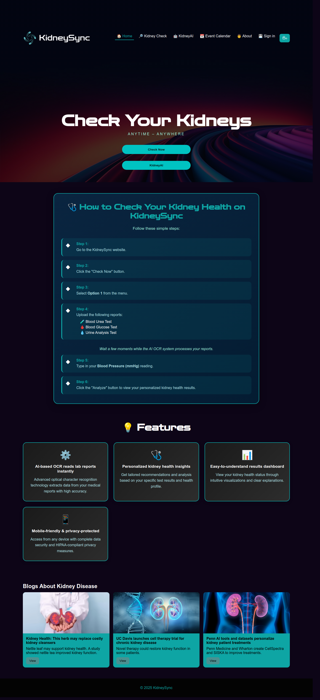

# 🧬 KidneySync — Empowering Kidney Health Through AI

> **Revolutionizing kidney disease detection and awareness.**  
> *Check your kidneys — Anytime, Anywhere.*

---

## 🌟 Overview

**KidneySync** is an AI-powered web application designed to assist users in monitoring kidney health through predictive analysis and educational content.  
It provides a **user-friendly, responsive interface** combined with a **Streamlit-based AI system** that predicts chronic kidney disease (CKD) using medical data inputs.

Our mission is to make **preventive kidney health checks** accessible and intelligent through modern technology.

---

## 🩺 Key Features

| Category | Description |
|-----------|--------------|
| 🧠 **AI Kidney Prediction** | Machine Learning–based model (Random Forest Classifier) for CKD detection |
| 📊 **Data Preprocessing** | Automated cleaning, encoding, and imputation of medical datasets |
| 🧾 **Health Insights** | Blogs and research articles related to kidney disease |
| 📅 **Event Calendar** | Tracks upcoming awareness events, seminars, and medical checkup camps |
| 👥 **User Authentication** | Simple sign-in module for personalized sessions |
| 💡 **Modern UI/UX** | Gradient interface, fluid animations, and fully responsive design |

---

## ⚙️ Tech Stack

| Layer | Technologies |
|-------|---------------|
| **Frontend** | HTML5, CSS3, JavaScript |
| **Styling & Fonts** | Google Fonts *(Poppins)*, Gradient Design |
| **Backend** | Python, Streamlit |
| **Machine Learning** | scikit-learn, pandas, numpy |
| **Deployment** | GitHub Pages *(UI)*, Streamlit Cloud *(AI System)* |

