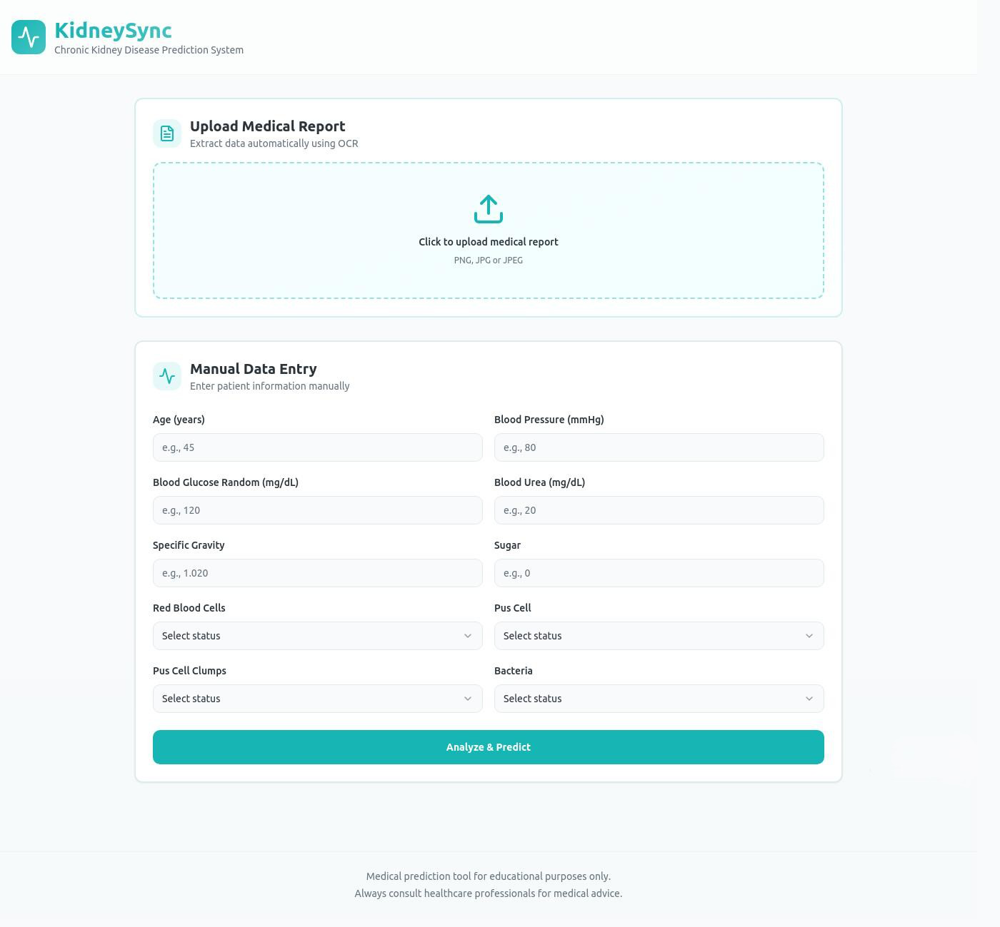

# 🧬 KidneySync — Empowering Kidney Health Through AI

> **Revolutionizing kidney disease detection and awareness.**  
> *Check your kidneys — Anytime, Anywhere.*

---

## 🌟 Overview

**KidneySync** is an intelligent web platform that combines **AI prediction**, **OCR-powered report parsing**, and an **interactive chatbot** to make kidney health monitoring simple, fast, and accessible.

Below is the prediction interface preview — click the image to open the live prediction demo.

---

## 🚀 Live Links

- **Project** — https://kidneysync.github.io/KidneySync/  
- **Prediction Demo** — https://kidneysync.lovable.app/

---

## 🩺 Key Features

- **AI Kidney Prediction** — Machine Learning model (Random Forest / tuned classifier) to flag likely CKD cases.  
- **OCR Medical Report Upload** — Upload PNG/JPG reports; values are automatically extracted via OCR (Tesseract/OpenCV pipeline).  
- **Chatbot Assistant** — In-app conversational assistant that explains results and suggests next steps.  
- **Manual Input Option** — For users who want to type values directly.  
- **Educational Content** — Blog posts, event calendar, and resources for kidney health awareness.  
- **Responsive & Accessible UI** — Desktop and mobile friendly with modern visuals.

---

## ⚙️ Tech Stack

- **Frontend:** HTML5, CSS3, JavaScript  
- **Backend / App:** Python, Streamlit  
- **ML:** scikit-learn, pandas, numpy  
- **OCR:** Tesseract OCR + OpenCV (data extraction & pre-processing)  
- **Chatbot:** Streamlit chat UI + lightweight NLP model or API  
- **Deployment:** GitHub Pages (UI), Streamlit Cloud / custom host (prediction & AI features)

---

## Code Owners

- Mr.X Zer
- Imesh S Abeysinghe
- Next Gen Creators

## ⚠️ Disclaimer

**KidneySync** is an **educational tool** and **NOT a substitute for professional medical diagnosis.**
Always consult a **licensed healthcare professional** for medical advice and diagnosis.

## 📜 License

Released under the MIT License.
**© 2025 KidneySync**